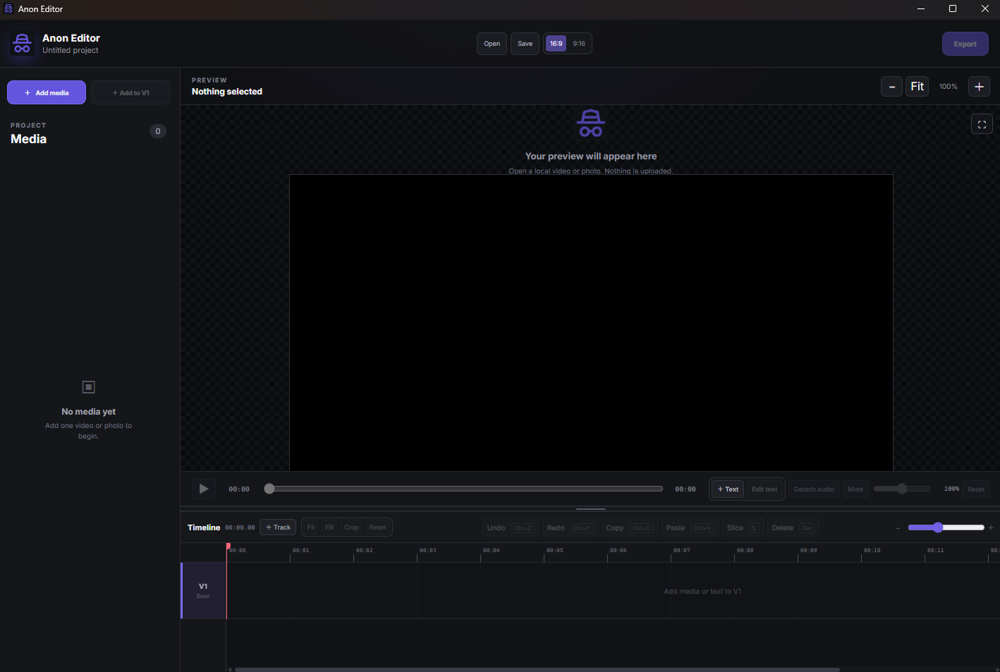

# Anon Editor

Anon Editor is a compact desktop video editor that rebuilds exports as verified,
origin-free MP4 files. It supports local media, multi-track editing, text,
transform controls, detached audio, and 1080p landscape or portrait export.

## Screenshot




## File anonymity

Anon Editor removes source and personal metadata instead of copying it into the
export. Video and audio are re-encoded, timestamps are zeroed, metadata boxes,
chapters, subtitles, side data, encoder labels, device details, locations, and
other source tags are rejected.

Only normalized technical data required to decode the file remains. Every export
is written temporarily, inspected, and published only after the strict verifier
passes. The resulting file contains no unique Anon Editor ID or project marker.

## Technical specifications

- Output: MP4, H.264 High 4.1, 30 FPS, YUV420p, BT.709
- Canvas: 1920x1080 landscape or 1080x1920 portrait
- Export presets: High Quality, Balanced, and Small File, all verified as
  anonymous MP4 output
- Audio: AAC, 48 kHz stereo, one normalized output stream
- Timeline: up to 100 video/audio tracks and 100,000 clips
- Editing: slice, trim, move, overlays, text, crop, Fit/Fill, volume, mute,
  detached audio, undo/redo, copy/paste, and timeline snapping
- Projects: local `.anonproj` files, up to 10 MB

Anon Editor is intended for short-form editing; practical media limits depend on
available CPU, memory, storage, and source complexity.

## Clone and run

Requirements: Git, Node.js 20+, and FFmpeg/ffprobe available on `PATH`.

```bash
git clone https://github.com/YRJ-10/anonymus-video-editor.git
cd anonymus-video-editor
npm install
npm start
```

Run the test suite with:

```bash
npm test
```
